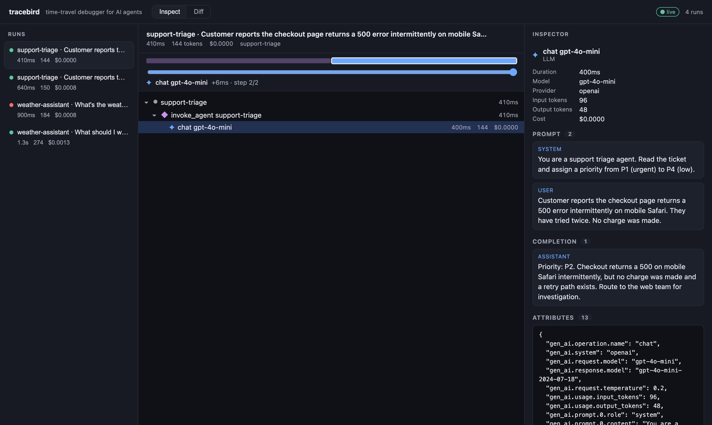

# tracebird

> **A local-first, time-travel debugger for AI agent runs.**
> "Redux DevTools for AI agents." Point it at any OpenTelemetry-emitting agent,
> step through the run locally, diff two runs to see what changed.
> No cloud, no account.

AI agents fail silently — a confident, wrong answer with no crash and no stack
trace. tracebird captures the OpenTelemetry GenAI spans your agent already
emits, reconstructs them into an inspectable decision tree, and lets you step
through and diff runs locally.



## Quickstart

Just want to see it? Open the UI pre-loaded with sample runs — no agent needed:

```sh
npx @tracebird/cli demo
```

Otherwise, start the receiver:

```sh
npx @tracebird/cli
```

Then point your agent's OpenTelemetry exporter at the local receiver and run it:

```sh
export OTEL_EXPORTER_OTLP_ENDPOINT=http://localhost:4318
```

That's the whole integration — **zero code changes** to your agent. tracebird
accepts OTLP/HTTP in both JSON and protobuf (the SDK default).

Have a saved session from a coworker? Replay it with no receiver:

```sh
npx @tracebird/cli open ./session.jsonl
```

## Features

- **Execution tree** — flat spans reconstructed into run → agent → LLM/tool.
- **Inspector** — prompt, completion, tool args/result, tokens, cost, model, timing.
- **Time-travel scrubber** — drag through the run; the selection follows time.
- **Diff** — pick two runs; see the structural + word-level text diff ("worked yesterday").
- **Live** — runs stream into the UI the moment they complete (SSE, no refresh).
- **Terminal tree** — `live` prints each reconstructed run as it arrives.

## Works with your stack

tracebird ingests the vendor-neutral OpenTelemetry **GenAI** conventions and
**auto-normalizes** the popular dialects, so the tree, tokens, cost, and prompts
render without configuration:

| Source | Notes |
| --- | --- |
| OpenLLMetry / Traceloop | OpenAI, Anthropic, LangChain, LlamaIndex, … |
| OpenInference (Arize Phoenix) | `openinference.span.kind` + `llm.*` |
| Vercel AI SDK | `experimental_telemetry` (`ai.*` spans) |
| Claude Code | enhanced telemetry (`claude_code.*`, beta) |
| Raw OpenTelemetry GenAI | `gen_ai.*` attributes or events |

See [`examples/`](./examples) for runnable agents — including a **keyless** one
that needs no API key.

## How it works

```
your agent ──OTLP/HTTP──▶ @tracebird/cli ──▶ @tracebird/core ──▶ @tracebird/ui
 (instrumented)            receiver + UI       span → run tree     inspect + diff
```

- **`@tracebird/core`** — pure span → agent-tree reconstruction. No I/O.
- **`@tracebird/cli`** — the `npx` entrypoint: OTLP receiver + static UI server.
- **`@tracebird/ui`** — React app: run list, execution tree, inspector, diff, scrubber.

## v1 scope

Read-only forensics on a completed run. **Not yet** (see [`ROADMAP.md`](./ROADMAP.md)):
replay-execution, cloud sync / hosted version, auth / multi-user, eval scoring,
multi-agent topology graphs, gRPC ingest, SQLite persistence, VS Code extension.

## Develop

This is an [Nx](https://nx.dev) + [pnpm](https://pnpm.io) integrated monorepo.

```sh
pnpm install

# Run it locally (builds the CLI + UI, then launches):
pnpm demo        # serve the UI with bundled sample runs — best first look
pnpm start       # start the OTLP receiver + UI on :4318 (point a real agent at it)

# Quality gates:
pnpm build       # nx run-many -t build  (all packages)
pnpm test        # nx run-many -t test   (80 unit/integration tests)
pnpm lint        # nx run-many -t lint
pnpm e2e         # end-to-end against the built CLI binary

npx nx test core   # a single project
npx nx dev ui      # UI dev server with HMR (proxies /api to :4318)
```

> `pnpm demo` / `pnpm start` build first, so they work from a fresh clone.

Releases are managed with [changesets](https://github.com/changesets/changesets);
CI (`.github/workflows`) runs build + test + lint + e2e on every PR.

| Package | Path | Description |
| --- | --- | --- |
| `@tracebird/core` | `packages/core` | Span ingest + tree reconstruction (pure). |
| `@tracebird/cli` | `packages/cli` | OTLP receiver, session storage, UI server. |
| `@tracebird/ui` | `packages/ui` | React/Vite front-end. |
| `@tracebird/fixtures` | `libs/fixtures` | Sample OTLP payloads + recorded sessions. |

## License

MIT
